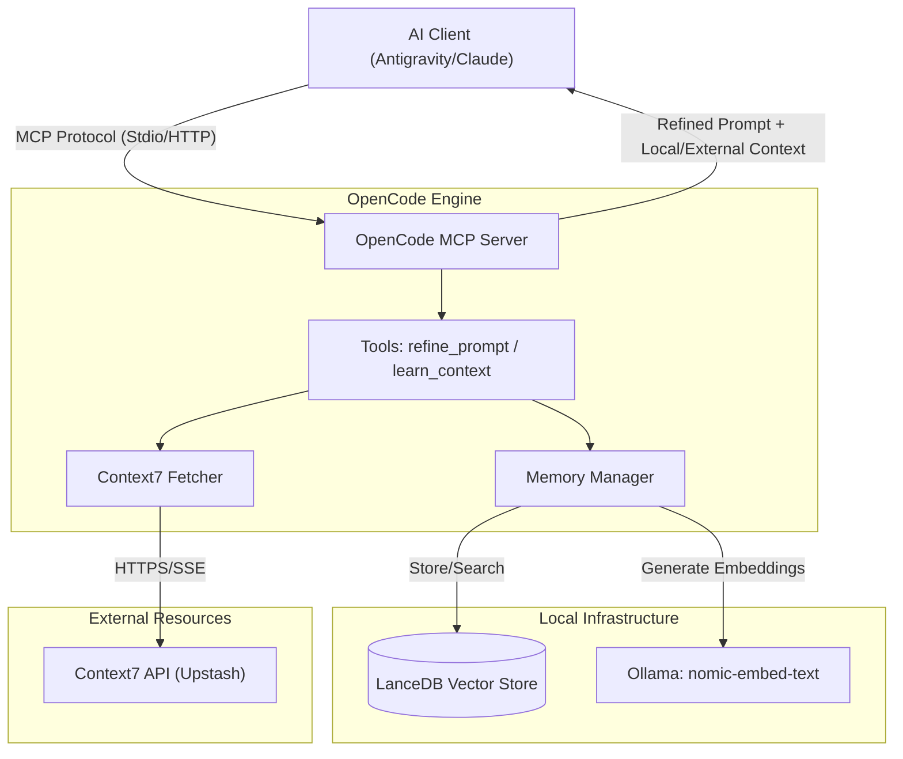
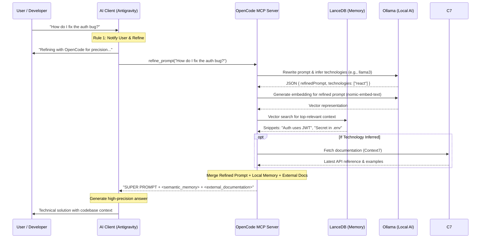

# 🚀 OpenCode MCP: High-Precision AI Orchestrator & Token Optimizer

[](https://opencode.ai/)
[](https://modelcontextprotocol.io/)

This repository contains the **OpenCode MCP Server**, a high-performance orchestration layer based on the [Model Context Protocol (MCP)](https://modelcontextprotocol.io/). It is designed to act as a **Proactive Architectural Assistant** for Antigravity, transforming how AI interacts with your codebase.

### The TL;DR: Think of it like a Tech Startup 🏢

If your local AI setup was a company:
- **Ollama** is the **Muscle** 🦾. It crunches the numbers, rewrites text, and generates vector embeddings.
- **LanceDB** is the **Archive** 🗄️. It securely stores and instantly retrieves snippets of your past technical decisions.
- **Context7** is the **Lead Researcher** 🕵️. It fetches the latest official documentation whenever a specific technology is mentioned.
- **OpenCode** is the **Engineering Manager** 👔. It receives your vague request, tells Ollama to rewrite it, searches the Archive for context, asks the Researcher for the latest docs, and packages it all into a perfect "Super Prompt" before handing it over to the CEO (your main LLM, like Claude or Antigravity) to write the final code.

The main goal of this MCP is to drastically save tokens and prevent hallucinations by ensuring your main AI model only processes highly refined, contextualized prompts.

## Features

- **Prompt Refinement**: Transforms vague prompts into detailed and technical instructions.
- **Real-time Documentation (Context7)**: Automatically fetches the latest documentation for technologies like Supabase, React, Tailwind, etc.
- **Development Support**: Assists in bug fixing and implementing new features with a focus on efficiency.
- **Semantic Memory**: Stores and retrieves technical context using **Semantic Chunking**, **Category Filtering**, and **XML Formatting**.
- **Proactive Indexing**: Automatically maps your project structure to memory for instant architectural awareness.
- **Memory Dashboard**: Visualize your knowledge distribution and memory health.

## Architecture

The OpenCode MCP Server acts as an orchestration layer between the AI Client and local specialized tools.



### The Process Flow



## Technology Stack

The solution is built using a modern and efficient stack designed for high performance and local privacy:

- **[OpenCode](https://opencode.ai/)**: The core orchestration engine that manages tool execution, prompt refinement logic, and semantic memory integration.
- **[Model Context Protocol (MCP)](https://modelcontextprotocol.io/)**: The standard protocol for connecting AI models to local/remote data and tools.
- **[LanceDB](https://lancedb.com/)**: A serverless, high-performance vector database that allows for incredibly fast semantic searches without the overhead of a traditional database server.
- **[Ollama](https://ollama.com/)**: Orchestrates local AI models. We use `nomic-embed-text` to generate high-quality vector embeddings locally, ensuring your technical data never leaves your machine.
- **[TypeScript](https://www.typescriptlang.org/) & [Node.js](https://nodejs.org/)**: Provides a type-safe and performant runtime environment for the server logic.
- **[Express](https://expressjs.com/)**: Used for the Remote Mode (HTTP/SSE), providing a robust foundation for the Streamable HTTP transport.

## Prerequisites

Before starting, you need to set up the development environment. We recommend using **NVM (Node Version Manager)** to manage Node.js versions on Windows.

### 1. NVM and Node.js Installation (Windows)

1. Download the `nvm-setup.exe` installer from [nvm-windows](https://github.com/coreybutler/nvm-windows/releases).
2. Follow the installation instructions.
3. Open a new **PowerShell** terminal and install the recommended Node.js version:
   ```powershell
   nvm install 22
   nvm use 22
   ```

### 2. Ollama Installation (For Local AI)

Ollama is heavily used by OpenCode MCP for two distinct local tasks:
1. **Embeddings:** Generating vectors for semantic memory (`nomic-embed-text`).
2. **Local Refinement:** Rewriting vague prompts and inferring technologies dynamically (`llama3` by default).

1. Open **PowerShell** as Administrator and run:
   ```powershell
   winget install ollama
   ```
2. After installation, restart the terminal and download the required models:
   ```powershell
   # Model for Vector Embeddings (Required)
   ollama pull nomic-embed-text
   
   # Model for Prompt Refinement & Inference (Recommended: llama3, qwen2.5:0.5b, etc.)
   ollama pull llama3
   ```

### 3. Verify Installation

Check if the tools are ready in **PowerShell**:

```powershell
node -v # Should return v22.x.x or higher
ollama --version
```

## Project Installation and Configuration

Follow the steps below to configure the OpenCode MCP Server using **PowerShell**:

1. **Clone the repository:**

   ```powershell
   git clone <repository-url>
   cd open-code-as-mcp
   ```

2. **Install dependencies:**

   ```powershell
   npm install
   ```

3. **Build the project:**
   ```powershell
   npm run build
   ```

## Antigravity Configuration

To integrate this MCP server with Antigravity, you must choose between **Local** mode (running on the same machine) or **Remote** mode (running on a server/cloud).

### Option A: Local Configuration (Stdio)

Use this option if the server is on the same machine as the client.

#### Global Memory (Default)

Memory will be shared across all projects and stored in the server folder.

```json
{
  "mcpServers": {
    "opencode": {
      "command": "node",
      "args": ["D:/IA/MCP/open-code-as-mcp/build/index.js"]
    }
  }
}
```

#### Per-Project Memory (Recommended)

For each project to have its own isolated memory inside the project's `.mcp_memory` folder.

> [!IMPORTANT]
> Always use **absolute paths** in the `MCP_MEMORY_PATH` environment variable when configuring the server in a global MCP config (like Claude Desktop). This ensures the server finds the correct folder regardless of the current working directory.

```json
{
  "mcpServers": {
    "opencode": {
      "command": "node",
      "args": ["D:/IA/MCP/open-code-as-mcp/build/index.js"],
      "env": {
        "MCP_MEMORY_PATH": "D:/IA/MCP/open-code-as-mcp/.mcp_memory/vectors"
      }
    }
  }
}
```

_Note: Be sure to add `.mcp_memory/` to your `.gitignore` if you don't want to version the database._

> [!TIP]
> Ensure **Ollama** is running and you have downloaded the model with `ollama pull nomic-embed-text`.

### Context7 Integration (Optional)

To enable real-time documentation retrieval, you can add your Context7 API key (get it at [context7.com](https://context7.com)).
OpenCode uses a local model via Ollama to intelligently **rewrite your prompt** and **infer which technologies** are mentioned before fetching their official documentation.

```json
{
  "mcpServers": {
    "opencode": {
      "command": "node",
      "args": ["D:/IA/MCP/open-code-as-mcp/build/index.js"],
      "env": {
        "CONTEXT7_API_KEY": "your_api_key_here",
        "ENABLE_CONTEXT7": "true",
        "MCP_INFERENCE_MODEL": "llama3"
      }
    }
  }
}
```

> [!TIP]
> Ensure you have pulled the inference model configured in `MCP_INFERENCE_MODEL` (e.g., `ollama pull llama3`) to allow the local refinement step to work properly.

### Option B: Remote Configuration (Streamable HTTP)

Use this option if the server is running remotely. The server uses the modern **Streamable HTTP** transport, which is more robust and efficient.

```json
{
  "mcpServers": {
    "opencode": {
      "url": "http://your-remote-server:3000/mcp"
    }
  }
}
```

_Note: The server also maintains backward compatibility for legacy clients at `http://your-remote-server:3000/sse`._

## Automatic Usage and Global Rules

To ensure Antigravity consistently follows best practices, the **Global Rules** are stored in two key locations:

1.  **Global Level (Windows)**: Inside the `GEMINI.md` file, located in your user profile: `%USERPROFILE%\.gemini\GEMINI.md` (a copy is available in this repo as [GEMINI.md](GEMINI.md)).
2.  **Project Level**: Inside the `.cursorrules` file in the root of this repository.

### Access via Environment Variable

You can reference the global rules path by setting an environment variable in your terminal or system configuration:

```powershell
$env:ANTIGRAVITY_RULES_PATH = "$HOME\.gemini\GEMINI.md"
```

### The Rules

To ensure Antigravity uses this MCP correctly, configure the following rules in your **System Prompt**:

# Antigravity Global Rules

1. **Prompt Refinement**: Whenever the user sends a request, first announce to the user: _"Refining your request with OpenCode for technical precision..."_, then use `opencode:refine_prompt`.
2. **Context Enrichment**: Upon receiving the refined prompt, validate if there are technical terms or project patterns that require additional lookup in semantic memory. Mention if you are pulling specific context from OpenCode memory.
3. **Continuous Learning**: After successfully implementing a complex feature, use `opencode:learn_context`. Briefly inform the user that this knowledge is being persisted in OpenCode's semantic memory.

> [!TIP]
> You can find the raw version of these rules in the [.cursorrules](.cursorrules) or [GEMINI.md](GEMINI.md) file for easy copying into your System Prompt.

## Available Tools

The OpenCode MCP provides the following tools:

### 1. `refine_prompt`

Refines a development prompt to make it clearer and more efficient, injecting targeted context via XML tags.

- **Arguments:**
  - `prompt`: (string) The original prompt that needs refinement.
  - `categoryFilter`: (string, optional) Optional category to filter memories (e.g., 'architecture', 'style') to increase precision and reduce token usage.

### 2. `learn_context`

Memorizes important information (preference, technical rule, context) for future use in semantic memory.

- **Arguments:**
  - `information`: (string) The information to be remembered.
  - `category`: (string, optional) Information category (e.g., 'preference', 'architecture', 'style').

### 3. `search_memory`

Directly queries the semantic memory without refining a prompt.

- **Arguments:**
  - `query`: (string) The search query.
  - `category`: (string, optional) Filter results by category.
  - `limit`: (number, optional) Number of results to return.

### 4. `index_codebase`

Performs a recursive scan of the project to build a structural map in memory.

- **Arguments:**
  - `path`: (string, optional) Root path to scan.

## 📊 Semantic Dashboard

You can visualize your memory health and stats using the local dashboard:

```powershell
node dashboard.cjs
```

## Remote Access (SSE)

The server supports remote access via **SSE (Server-Sent Events)**. To run in remote mode in **PowerShell**, use:

### Running in remote mode:

```powershell
$env:MCP_MODE="sse"; $env:PORT="3000"; npm start
```

## Development

To run the server in development mode with hot-reload in **PowerShell**:

```powershell
npm run dev
```

## Debugging

You can test the server locally by running in **PowerShell**:

```powershell
node build/test-mcp.js
```

## Token Efficiency Validation

A technical analysis was performed to measure the efficiency of semantic retrieval vs. full-context injection.

### Test Scenario 1: Local Semantic Memory (Auth Middleware Migration)

- **Knowledge Base**: Complex technical documentation for migrating session-based authentication to JWT, including security rules and legacy fallback patterns (~8,000 characters).
- **Query**: "How to implement the JWT fallback for legacy session endpoints?"

#### Results (Local Memory)

| Metric                | Traditional (Full Context) | MCP (Semantic Retrieval) | Efficiency Gain   |
| :-------------------- | :------------------------- | :----------------------- | :---------------- |
| **Characters Sent**   | ~8,000                     | ~950                     | **~88% Savings**  |
| **Tokens (Est. 1:4)** | ~2,000                     | ~238                     | **~88% Savings**  |
| **Response Accuracy** | Medium (Noise risk)        | High (Exact context)     | Qualitative Boost |

### Test Scenario 2: Context7 Real-Time Documentation Impact

- **Scenario**: A developer asks a poorly formulated, open-ended question about a specific technology that requires strong external context.
- **Query**: *"how do I create a server with nodejs? is there a fast way?"*

#### Results (Context7 Integration)

| Metric | Without Context7 (Local Only) | With Context7 Enabled | Impact |
| :--- | :--- | :--- | :--- |
| **Tokens (Est.)** | ~285 tokens | ~1,712 tokens | +1,427 tokens |
| **Context Quality** | Limited to local codebase memory | High (Injected official Node.js/Express docs) | Drastic Contextual Boost |
| **Risk of Hallucination** | High (Model relies on generic training data) | Zero (Grounded by official `<external_documentation>`) | Precise Answers |

**Conclusion**: While Context7 integration *increases* token consumption, it acts as a precise targeted injection. For complex or poorly formulated questions, spending ~1.4k tokens to inject the exact official documentation prevents multi-turn hallucination loops, ultimately saving time and total tokens across a debugging session.

### Advanced Optimizations

To maximize efficiency, the server actively implements:

1. **Semantic Chunking**: Large knowledge blocks are automatically split into smaller, focused chunks before being embedded. This ensures only the exact relevant paragraph is retrieved.
2. **Category Filtering**: Queries can be scoped to specific categories (e.g., `architecture` or `style`), significantly reducing noise and allowing the result limit to be tightened.
3. **XML Context Formatting**: Retrieved memories are injected into the prompt using strict XML tags (`<semantic_memory>` and `<context_item>`). This aligns with how modern LLMs best parse context, eliminating attention dilution.

## Benefits of OpenCode MCP

1. **Token Savings**: By refining prompts locally, we reduce the context load sent to Antigravity.
2. **Enriched Context**: OpenCode can access local files and provide richer context for Antigravity.
3. **Agility**: Fast responses for refinement tasks.

---
